# 📄 Generador de Planillas - Proyecto de Seminario de Prácticas

### 📝 Descripción:
Este proyecto es parte del curso de seminario de prácticas y tiene como objetivo desarrollar una 🛠️ aplicación que automatiza la generación de planillas. A través de esta herramienta, los usuarios pueden:

📑 Crear y organizar planillas.
🗂️ Administrar eficientemente datos.
🛡️ Reducir errores humanos.
El proyecto pone en práctica principios de desarrollo de software, integrando tecnologías actuales y un enfoque en la calidad y escalabilidad del código.

## ⚙️ Requisitos del Proyecto

### 🖥️ **Software Necesario**

1. **Docker Desktop**
    - Utilizado para ejecutar el entorno de Laravel en contenedores.
    - [Descargar Docker Desktop](https://www.docker.com/products/docker-desktop).
    - Verifica la instalación ejecutando:
      ```bash
      docker --version
      ```

2. **Git**
    - Utilizado para clonar el repositorio y gestionar el control de versiones.
    - [Descargar Git](https://git-scm.com/download/win).
    - Verifica la instalación ejecutando:
      ```bash
      git --version
      ```

### 🔧 **Pasos de Instalación**

1. **Clonar el Repositorio:**
   ```bash
   git clone git@github.com:Drz17/EvidentProject.git
   ```
2. **Configurar el Archivo .env:**
   - Copia el archivo `.env.example` y renómbralo a `.env`.
   - Configura las variables de entorno en el archivo `.env`.
   - Ejemplo:
     ```env
     DB_CONNECTION=mysql
     DB_HOST=db
     DB_PORT=3306
     DB_DATABASE=laravel
     DB_USERNAME=root
     DB_PASSWORD=db_data_123
     ```

3. **Construir y Levantar los Contenedores:**
   ```bash
   docker-compose up -d --build
   ```

4. **Migrar la Base de Datos:**
   ```bash
   docker-compose exec app php artisan migrate
   ```

4. **Acceder a la Aplicación:**
   - La aplicación estará disponible en `http://localhost:8040`.
   - Para acceder a la consola de Laravel, ejecuta:
     ```bash
     docker-compose exec app bash
     ```
   - El DBMS estará disponible en `http://localhost:8030`.
   - Para acceder a la consola de MySQL, ejecuta:
     ```bash
     docker-compose exec db bash
     ``` 

# Esquema de base datos

```mermaid
   
    erDiagram
 
        datos_personales {
            int id PK
            string numero_documento
            string pais_documento
            date fecha_nacimiento
            string apellido_paterno
            string apellido_materno
            string nombres
            string sexo
            string codigo_telefono_larga_distancia
            string numero_telefono
            string correo            
            string direccion_1_nombre_via
            string direccion_1_numero_via
            string direccion_1_departamento
            string direccion_1_interior
            string direccion_1_manzana
            string direccion_1_lote
            string direccion_1_kilometro
            string direccion_1_block
            string direccion_1_etapa
            string direccion_1_tipo_zona
            string direccion_1_nombre_zona
            string direccion_1_referencia
            string direccion_2_tipo_via
            string direccion_2_nombre_via
            string direccion_2_departamento
            string direccion_2_interior
            string direccion_2_manzana
            string direccion_2_lote
            string direccion_2_kilometro
            string direccion_2_block
            string direccion_2_etapa
            string direccion_2_tipo_zona
            string direccion_2_nombre_zona
            string direccion_2_referencia
            string indicador_centro_asistencial_essalud            
            int estado
 
            int id_tipo_documento FK
            int id_nacionalidad FK
            int id_direccion_1_tipo_via FK
            int id_direccion_1_tipo_zona FK
            int id_direccion_2_tipo_via FK
            int id_direccion_2_tipo_zona FK
        }
 
        datos_personales ||--|| tipo_documento_entidades : tiene
        datos_personales ||--|| nacionalidades : "proviene de"
        datos_personales ||--|| vias : tiene
        datos_personales ||--|| zonas : "proviene de"
 
        establecimientos_propios_empleador {
            int id PK
            string codigo_establecimiento
            string centro_risgo
            int estado
        }
 
        datos_trabajador {
            int id PK            
            string numero_documento_trabajador
            string discapacidad
            string cuspp
            string sctr_pension
            string sujeto_regimen_alternativo
            string sujeto_jornada_maxima
            string sujeto_horario_nocturno
            string es_sindicalizado
            string monto_remuneracion
            string renta_quinta_categoria
            string tipo_pago
            string numero_ruc
            int estado
 
            int id_tipo_documento_trabajador FK
            int id_situacion_educativa FK
            int id_ocupacion FK
            int id_tipo_contrato_trabajo FK
            int id_periodicidad_remuneracion_ingreso FK
            int id_situacion FK
            int id_categoria_ocupacional_trabajador FK
            int id_convenio_evitar_doble_tributacion FK            
        }
 
        datos_trabajador ||--|| tipo_documento_entidades : tiene
        datos_trabajador ||--|| nivel_educativos : tiene
        datos_trabajador ||--|| ocupaciones : tiene
        datos_trabajador ||--|| tipo_contratos : tiene    
        datos_trabajador ||--|| periodicidad_remuneraciones : tiene
        datos_trabajador ||--|| situacion_trabajadores : tiene    
        datos_trabajador ||--|| categoria_ocupacional_trabajador : tiene    
        datos_trabajador ||--|| convenios_evitar_doble_atributacion : tiene    
 
        tipo_actividades {
            int id PK
            string codigo
            string descripcion
            int estado
        }
 
        tipo_estableciomientos {
            int id PK
            string codigo
            string descripcion
            int estado
        }
 
        tipo_documento_entidades {
            int id PK
            string codigo
            string descripcion
            int estado
        }
 
        nacionalidades {
            int id PK
            string codigo
            string descripcion
            int estado
        }
 
        vias {
            int id PK
            string codigo
            string descripcion
            int estado
        }
 
        zonas {
            int id PK
            string codigo
            string descripcion  
            int estado
        }
 
        ubigeo {
            int id PK
            int codigo_departamento
            int codigo_provincia
            int codigo_ubigeo
            int estado
        }
 
        tipo_trabajador {
            int id PK
            string codigo
            string descripcion  
            int estado
        }
 
        nivel_educativos {
            int id PK
            string codigo
            string descripcion  
            int estado
        }
 
        ocupaciones {
            int id PK
            string codigo
            string nombre  
            int estado
        }
 
        regimen_pensionario {
            int id PK
            string codigo
            string descripcion  
            int estado
        }
 
        tipo_contratos {
            int id PK
            string codigo
            string descripcion  
            int estado
        }
 
        periodicidad_remuneraciones {
            int id PK
            string codigo
            string descripcion  
            int estado
        }
 
        prestaciones_salud {
            int id PK
            string codigo
            string ruc
            string descripcion  
            int estado
        }
 
        situacion_trabajadores {
            int id PK
            string codigo
            string descripcion  
            int estado
        }
 
        motivo_fin {
            int id PK
            string codigo
            string descripcion  
            int estado
        }
 
        modaliddad_foramtiva {
            int id PK
            string codigo
            string descripcion  
            int estado
        }
 
        vinculo_familiar {
            int id PK
            string codigo
            string descripcion  
            int estado
        }
 
        motivo_baja {
            int id PK
            string codigo
            string descripcion  
            int estado    
        }
 
        tipo_suspencion {
            int id PK
            string codigo
            string descripcion  
            int estado
        }
 
        ingresos_atributos_descuentos {
            int id PK
            string codigo
            string descripcion  
            int essalud_seguro_agrario_agricultor
            int essalud_sctr
            int impuesto_extraordinario_solidaridad
            int fondos_derechos_sociales_artista
            int senati
            int sistema_nacional_pensiones
            int sistema_privado_pensiones
            int renta_quinta_categoria
            int essalud_seguro_regular_pensionista
            int contribucion_solidaria_asistencia_previs
            int estado
        }
 
        tipo_comprobante {
            int id PK
            string codigo
            string descripcion  
            int estado
        }
 
        categoria_ocupacional_trabajador {
            int id PK
            string codigo
            string descripcion  
            int estado  
        }
 
        convenios_evitar_doble_atributacion {
            int id PK
            string codigo
            string descripcion  
            int estado  
        }
 
        datos_periodos {
            int id PK
            string tipo_documento
            string numero_documento
            string categoria
            string tipo_registro
            date fecha_inicio
            int estado
        }
```


